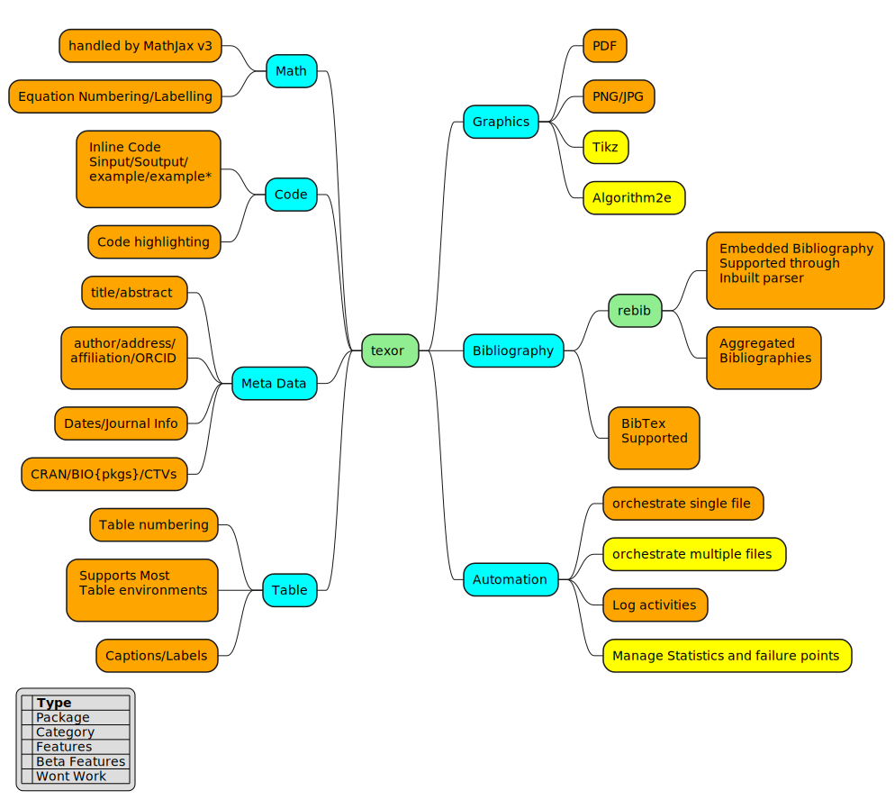

<!-- README.md is generated from README.Rmd. Please edit that file -->

# texor : Tools for converting LaTeX source files into RJ-web-articles

<!-- badges: start -->

[](https://github.com/Abhi-1U/texor/actions/workflows/pkg_down.yaml)
[](https://github.com/Abhi-1U/texor/actions/workflows/cmdcheck.yaml)
[](https://github.com/Abhi-1U/texor/blob/master/DESCRIPTION)

<!-- badges: end -->

texor is a package that deals with multiple challenges that occour in
conversion of LaTeX source files (which typically generate a PDF) to a
web friendly RJ-web-article format.

### Currently texor can handle R-Journal structured LaTeX files with support for:

1.  RJournal based LaTeX files with macros such as
    `\pkg{}`,`\CRANpkg{}`,`\BIOpkg{}`, `\code{}`, `\acronym{}`
2.  Reading Metadata from LaTeX file as well as DESCRIPTION.
3.  Reading bibliography from bibtex files and ignoring
    `\thebibliography`
4.  Supports code environments like `Sinput`,`Soutput`, `example`
    ,`example*`,`verbatim`, `smallverbatim` with code highlight.
5.  Supports graphics included as PDF, PNG, JPG, tikz, algorithm2e
    graphics supported (some figures might not work).
6.  Functions to convert PDF graphics to PNG.
7.  Almost all tables are supported with a few exceptions.
8.  Other things like citations,links,footnotes,math,CTV,package
    references are also supported.
9.  A parser to read and minimally convert inbuilt `\thebibliography` to
    bibtex (moved to [rebib](https://github.com/Abhi-1U/rebib))
10. Figure/Table/Equation numbering
11. Stream Editor to rename alien commands/environments to accepted
    defaults.
12. Pre and Post conversion statistics of environments for verification.
13. Bibliography aggregation.(moved to
    [rebib](https://github.com/Abhi-1U/rebib))
14. Tikz,algorithm graphics supported (some figures might not work)
15. Logging of events.



### Note :

Update : relative paths should also work with current development
version.

Please use absolute paths when working with texor/rebib !

~~The reason is that earlier texor used to work with relative paths by
using setwd(), getwd() to handle working directories. However this was
not an ideal method to handle paths and working on files.~~

~~Hence I had to switch to absolute path system for almost all functions
where automation is possible and works well. As there was no changing of
working directories there is less risk of setting up a wrong working
directory when failing certain function.~~

Use forward slashes (/) in paths and do not add a forward slash at the
end of the path for example

1.  Wrong usage : `C:\projects\texor\main`
2.  wrong usage : `C:/projects/texor/main/`
3.  wrong usage : `C:\\projects\\texor\\main\\`
4.  wrong usage : `C:\\projects\\texor\\main` (this may work with R)
5.  Correct usage : `C:/projects/texor/main`

## Installation

install these dependency packages (github development versions)

``` r
# install.packages("remotes")
remotes::install_github("rstudio/distill")
remotes::install_github("Abhi-1U/rjtools")
remotes::install_github("Abhi-1U/rebib")
```

install the development version from GitHub with:

``` r
# install.packages("remotes")
remotes::install_github("Abhi-1U/texor")
# install.packages("pak")
pak::pak("Abhi-1U/texor")
# also install rebib for bibliography
remotes::install_github("Abhi-1U/rebib")
```

## General Usage

here is a quick example to use texor package with a sample RJournal
article (included with the package
[inst/article](https://github.com/Abhi-1U/texor/tree/master/inst/examples/article))

``` r
# for a single LaTeX article 
texor::latex_to_web(article_dir)
# for multiple articles in RJ folder structure

#base dir 
article_dir <- "C:/Users/abhis/Documents/projects/gsoc-2022/original"
# list of journal number directories
journal_dirs <- list.dirs(article_dir,recursive = FALSE)
# list of individual slug directories
slug_dirs <- lapply(journal_dirs,function(journal_dir) {
    list.dirs(journal_dir,recursive = FALSE)
})
# creating a single list of all slug directories
slug_dirs <- unlist(slug_dirs)
# Calling 
for (dir in slug_dirs) {
    #print(dir)
    getwd()
    # below function will create a log file of success/error in current
    # working directory while running the texor::latex_to_web() function
    texor::convert_to_html(dir)
}
```
